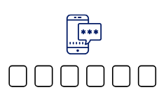

# vue-otp-autofill

📲 A simple and customizable **Vue 3 OTP input component** with **SMS auto-fill** support using the **Web OTP API**.

---

## ✨ Features
- 🔢 OTP input boxes with auto focus & navigation  
- 🔤 Persian → English digit conversion (for SMS codes in Persian)  
- 📲 SMS Auto-fill with [Web OTP API](https://web.dev/web-otp/)  
- 🎨 Lightweight styling with simple animations  
- ⚡ Vue 3 + Composition API ready  

---

## 📦 Installation
```bash
npm install vue-otp-autofill
```

## 🚀 Usage

### Basic
```vue
<template>
    <OtpInput v-model="otp" :length="6" />
    <button :disabled="otp.length !== 6" @click="submit">Submit</button>
</template>

<script setup>
    import { ref } from "vue";
    import OtpInput from "vue-otp-autofill";

    const otp = ref("");
    const submit = () => {
    console.log("OTP:", otp.value);
    };
</script>
```
### With Form (listen to v-model)
```vue
<template>
    <form @submit.prevent="onVerify">
        <OtpInput v-model="code" :length="5" />
        <p v-if="code.length !== 5">Enter 5 digits</p>
        <button :disabled="code.length !== 5">Verify</button>
    </form>
</template>
<script setup>
    import { ref } from "vue";
    import OtpInput from "vue-otp-autofill";
    const code = ref("");
    const onVerify = () => {/* call API with code.value */};
</script>
```

## ⚙️ Props

|   Prop   |   Type   | Default	 | Description |
|----------|----------|----------|-------------|
|modelValue|String|""|The OTP value (two-way bound via v-model)|
|length|Number|6|Number of input boxes|

## 🧠 How it works

-Each box holds one character.

-Typing a digit advances focus to the next box.

-Backspace on an empty box jumps to the previous.

-Persian digits ۰-۹ are auto-converted to English 0-9.

-When supported, Web OTP API can auto-fill from SMS.

### 📲 Web OTP API (SMS Autofill)

If supported (mainly Chrome on Android, over HTTPS), the component will request the OTP automatically and fill the boxes.

### Required SMS format (examples):
```diff
<#> Your verification code is: 123456
@https://your-domain.com #123456
```

or

```diff
<#> 654321 is your code
@https://your-domain.com #654321
```

### Important notes

Must be served over HTTPS.

The origin in SMS (after @) must match the page origin exactly (scheme + domain + port).

Only one active navigator.credentials.get({ otp }) per page.

Some Android ROMs/browsers block this; the component will gracefully degrade to manual input.

## 🎨 Styling

The component ships with minimal CSS classes you can override:
```css
/* Override in your app if you want */
.otp-container {
  direction: ltr;
  display: flex;
  gap: .5rem;
  justify-content: center;
}

.digit-box {
  width: 2.25rem;
  height: 2.75rem;
  text-align: center;
  font-size: 1.25rem;
  border: 2px solid #111;
  border-radius: 8px;
}

.digit-box:focus {
  outline: 3px solid #111;
}

.bounce {
  animation: otp-bounce .25s ease-in-out;
}

@keyframes otp-bounce {
  0% { transform: scale(1); }
  100% { transform: scale(1.06); }
}
```

## 🧪 TypeScript
```typescript
// shims-vue.d.ts (if needed)
declare module "vue-otp-autofill";
```
## 🛠️ Nuxt / Vite

-Vite (Vue 3): فقط import کن مثل مثال بالا.

-Nuxt 3: در صورت SSR، این کامپوننت خودش Web OTP رو فقط روی کلاینت فعال می‌کنه؛ مشکلی نداری.

## 🦾 Accessibility

-Boxes are regular <input type="text" maxlength="1">.

-Arrow keys (Left/Right) navigate.

-Backspace behavior mirrors native OTP inputs.

-Screen readers will read each box;

## 🧯 Troubleshooting

-No SMS autofill prompt on Android:

 -Check HTTPS.

 -SMS must include @https://YOUR_ORIGIN exactly.

 -Only one call to navigator.credentials.get should be active.

 -Try real device + Chrome (not WebView in some shells).

 -Some carriers’ SMS gateways rewrite messages; ensure your template stays intact.

-Digits don’t move to the next box on mobile:

 -Some virtual keyboards send composition events; the component handles input + normalization. If you customized handlers, prefer @input over @keydown.

-Persian digits aren’t recognized:

 -Included converter maps ۰-۹ → 0-9. If you have Arabic-Indic ٠-٩, extend the map accordingly.

## 🖼️ Demo

Add a screenshot/gif to your repo and reference it:



## 📃 License

MIT © 2025 — dnylfrd
